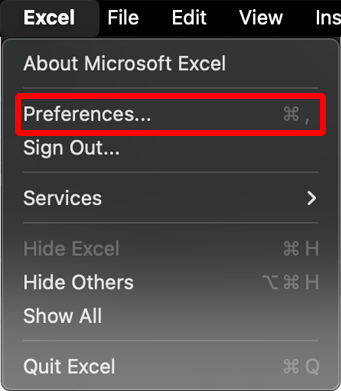
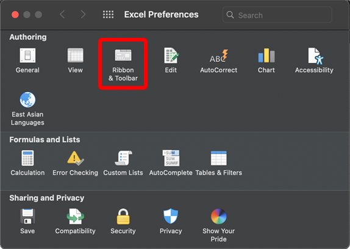
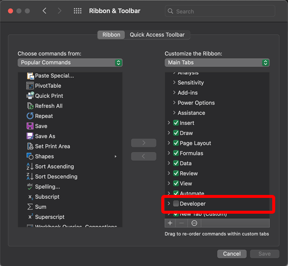
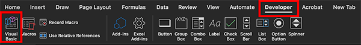
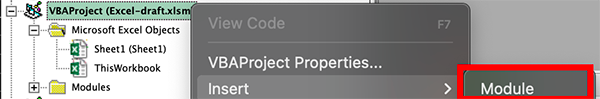
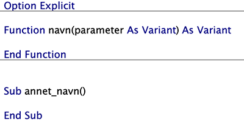
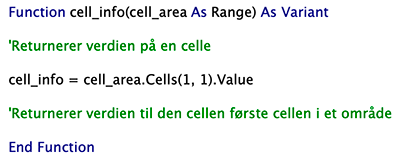
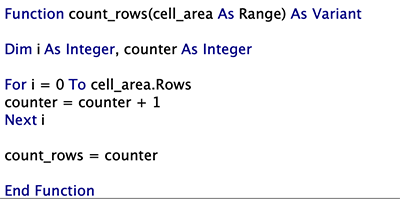
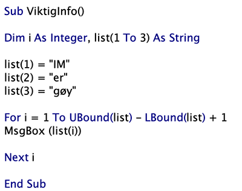
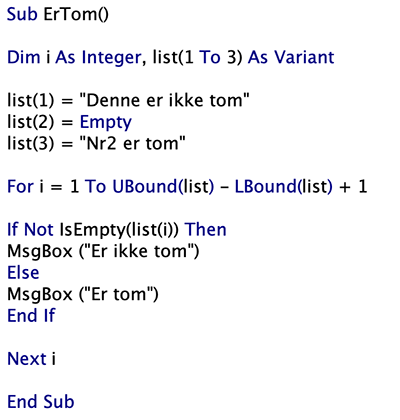

# Hvordan kode i Excel
## Innledende kurs i VBA-koding i Excel

### Hva er VBA?
>VBA (Visual Basic for Applications) er et programmeringsspråk utviklet av Microsoft.
>
>VBA er designet for å fungere med ulike Office-applikasjoner, som Excel, Word og PowerPoint.
>
>VBA er en god løsning til å automatisere eller forenkle arbeid i disse programmene.

### Oppstart
> Last ned [denne](./Excel-draft.xlsm) Excel-filen
>
> **Viktig!** Pass på at filen er en xlsm-fil (macro-enabled) og ikke vanlig xlsx, eller så vil ikke VBA funke
>
>Dette kan gjøres når du lagrer en fil
>
>")
>
>Når du åpner en Xlsm-fil, pass på at Macros er på
>
>

> Excel -> Preferences
>
>
>
> ELLER '⌘' + ' , '

 

> Velg *Ribbon & Toolbar*
>
>

 

> Bla ned til Developer og skru den på
>
>
>
> **HUSK Å LAGRE!**

>Åpne Visual Basic på Developer-tabben
>
>
>
>Velg riktig fil og sett inn en modul
>
>
>
>Gi modulen et passende navn

## I modulen
>
>Skriv "Option Explicit" øverst (viktig for at programmet skal kjøre uten feilmeldinger)
>
>Oppsettet til en funksjon er: 
>
>>Function *navn*(*parameter* as *datatype*) as *datatype*
>
>Der den siste defineringen sier hva slags type data som skal bli returnert i Excel
>
>**Husk!** På slutten av funskjonen må du skrive "End Function"
>
>Man kan også bruke subs, som kjører automatisk istedet for å bli fremkalt
>
>

## Viktige datatyper
|Name of datatype | Meaning of datatype |
|-----------------|---------------------|
|Variant | User-defined data type, flexible but inaccurate
|Range | For functions and objects only, an set of cells on the sheet
|Integer | Set of positive and negative numbers without decimals 
|String | Set of characters
|Double | Sets of two floats
|Boolean | True or False

## Variabler
>Variabler defineres på denne måten:
>
>>Dim *navn på variabel* As *datatype*
>
>Så defineres verdien på variabelen slik:
>
>>*navn på variabel* = *verdi*
>
>Måten man definerer verdien på en string er også slik man endrer verdien 
>
>

## Celler
>Et område er beskrevet under Range-variabelen
>
>For å få antall celler i et område må man skrive *range-variabel*.Count
>
>For å få en spesifikk celle skriver man *range-variabel*.Cells(*x-verdi til cellen*, *y-verdi til cellen*)
>
>Innholdet til en celle får man ved å legge til .Value på slutten
>
>

## Rader og kolonner
>Ved å legge til enten Rows eller Columns etter en range-variabel kan du spefisere om den bare skal se på rader eller kolonner
>
>Du kan fortsatt få antall og spesifikke celler ved å legge det bak enten .Rows eller .Columns
>
>Du trenger ikke spesifisere både x- og y-verdien til en celle hvis området bare er en rad eller en kolonne.

## For-løkke
>En for-løkke defineres på denne måten:
>
>>For i=0 To *verdi* *(For-løkken varer til i = verdi)*
>>
>>*Innhold i forløkken*
>>
>>Next i *(Øker i med en)*
>
>

## Lister
>En liste er definert som en vanlig variabel, men med paranteser med antall "plasser" etter navnet på variabelen, f.eks. "Dim numbers(1 to 3) as Integer"
>
>Lister kan inneholde alle typer data som er definert med variabelen. Hvis den er definert som Integer kan den ikke inneholde strings.
>
>For å få lengden til en liste må du skrive "UBound(*navn på liste*) - LBound(*navn på liste*) + 1"
>
>

## If-setning
>
>En if-setning er satt opp slik:
>
>>If *betinget spørring* Then
>>
>>*Innhold i if-setningen*
>>
>>End If *(stopper if-setningen)*
>
>Ved å legge til "Not" etter if vil det returneres hvis spørringen ikke stemmer
>
>

## Hindre feil
>For å hindre at lister eller celler er tomme kan du skrive "IsEmpty()" for å se om det er null
>
>Får å unngå at koden skal stanse på en feil kan du bruke "On Error GoTo *ønsket linje*"
>
>MsgBox skriver ut meldinger, som kan brukes til å Debuge kode

## Oppgave
>
>Lag en funksjon i det inkluderte Excel-dokumnentet som skriver ut i feltene hvor mange kolonner hver farge har majoriteten i.
>
>Hint: Kan gjøres enten ved å lage funksjon for hver kolonne, og så summere alle sammen med COUNTIF (enkel) eller en som ser gjennom hele området (vanskelig)

